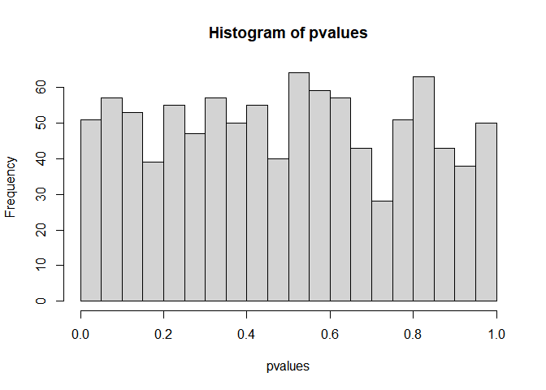
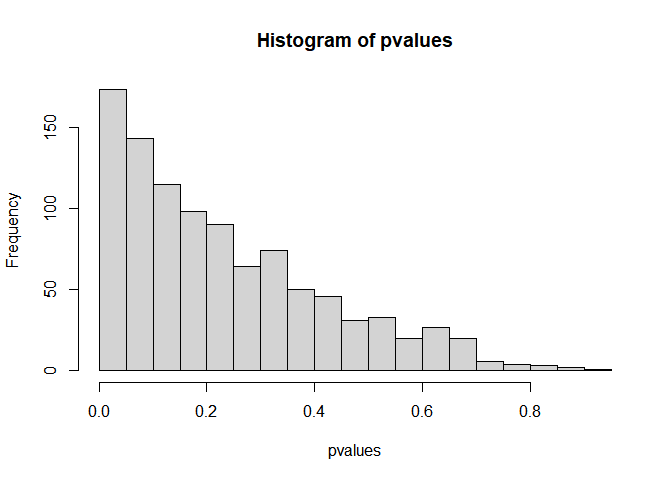

Data Science Group Notes
================

# Introduction

This file supports a presentation for the QIB Data Science group in June
2023

# Exploring the garden of forking paths

If I want to look at the implications of a particular statistical
procedure I will often simulate some data with known properties and then
test how well I can recover them.

Here I will look at the effect of trying lots of different analyses on
the same dataset.

Suppose we will be testing whether $y$ depends on $x$ in a small
observational dataset of men and women. We’ll also measure a covariate
$z$.

We will use a linear regression model, but will test the implications of
different design choices on the validity of the analysis.

``` r
# Set the dataset size
N = 20

# Here is a dataset in which Y does not depend on X.
df <- data.frame(
  X = rnorm(N),  # The predictor of interest.
  Z = rnorm(N),  # Covariate
  Sex = rep(c("M","F"),each=N/2),  # Sex of participant
  Y = rnorm(N)   # The outcome.  We know it is not influenced by the predictor.
)

# Check the dataset.
df
```

                 X           Z Sex          Y
    1  -2.58985430 -0.01906942   M -0.4556069
    2  -0.48076408 -0.07444334   M  1.3315597
    3   1.28506198 -0.49222336   M -0.6494060
    4   0.19313532 -0.29589310   M -0.1349421
    5  -1.10259524  1.14005625   M -0.3348897
    6   0.25664304  0.12658199   M -0.3715357
    7  -0.27870854 -0.59448630   M -0.2356117
    8   0.06652357  0.60777430   M -1.0104844
    9  -0.65108339 -0.31306539   M  1.6414039
    10  0.36704277 -1.52452116   M -1.7033753
    11  0.28431027  1.11712171   F  0.1120709
    12  0.70776108 -0.03947311   F  1.3547836
    13 -0.00293671  1.40497230   F -1.6796357
    14  0.97550408  1.71074383   F -1.1778335
    15 -1.98397444  1.00086333   F -0.2685324
    16  0.88005353  0.35026828   F  0.8213132
    17 -0.32544723  0.71158196   F -1.3775428
    18 -1.23213942  0.82726498   F -0.8791086
    19 -0.46954848  0.89444948   F -0.4648820
    20  0.28378727 -0.72223381   F -0.5310094

``` r
# Analysis 1 - linear regression for X on Y.
# Tidyverse way
pvalue1 <- lm(data=df , Y~X) |> 
  broom::tidy() |> 
  dplyr::pull(p.value) |> 
  purrr::pluck(2)  # There has got to be an easier way to do this.

# Or the old way
model1  <- lm(data=df, Y~X)
pvalue1 <- coef(summary(model1))["X", "Pr(>|t|)"]

# What should the p-value be?
pvalue1
```

    [1] 0.9645074

To see if the regression model is working OK, we should look at the
distribution over repeated experiments.

We know that 5% of p-values should be less than p=0.05. 10% should be
less than 0.1 etc….

To check this, we encase the previous code in a function, and then use
`replicate` to repeat it:

``` r
oneRep <- function(N=20){
  
  # New data
  df <- data.frame(
    X = rnorm(N),  # The predictor of interest.
    Z = rnorm(N),  # Covariate
    Sex = rep(c("M","F"),each=N/2),  # Sex of participant
    Y = rnorm(N)   # The outcome.  We know it is not influenced by the predictor.
  )
  # Return the p-value
  coef(summary(lm(data=df, Y~X)))["X", "Pr(>|t|)"]
  
}

pvalues <- replicate(1000 , oneRep(20))

hist(pvalues , breaks=20)
```



What happens if we adjust for the covariate in the model.

``` r
oneRep <- function(N=20){
  
  # New data
  df <- data.frame(
    X = rnorm(N),  # The predictor of interest.
    Z = rnorm(N),  # Covariate
    Sex = rep(c("M","F"),each=N/2),  # Sex of participant
    Y = rnorm(N)   # The outcome.  We know it is not influenced by the predictor.
  )
  # Return the p-value
  coef(summary(lm(data=df, Y~X+Z)))["X", "Pr(>|t|)"]
  
}

pvalues <- replicate(1000 , oneRep(20))

hist(pvalues , breaks=20)
```


So both models look OK. They both have the same false positive rate, and
it’s correct.

Which one is correct?

Now what happens if we can run either model or a model with sex as an
additional covariate, and choose the one that works the best.

``` r
oneRep <- function(N=20){
  
  # New data
  df <- data.frame(
    X = rnorm(N),  # The predictor of interest.
    Z = rnorm(N),  # Covariate
    Sex = rep(c("M","F"),each=N/2),  # Sex of participant
    Y = rnorm(N)   # The outcome.  We know it is not influenced by the predictor.
  )

  # Apply models and p-value extraction to two different formulas
  pvalues <- list( Y~X , Y~X+Z , Y~X+Z+Sex ) |> 
    lapply(lm, data=df) |> 
    sapply(\(m) coef(summary(m))["X", "Pr(>|t|)"] )
  
}

oneRep()

pvalues <- replicate(1000 , oneRep(20)) |> apply(2, min)

hist(pvalues , breaks=20)
```


What is the type-1 error rate of this procedure?

``` r
100 * mean(pvalues<0.05)
```

    [1] 7

Finally, what else could we do?

Subgroup analyses (men vs women vs all), remove ‘outliers’ or not (\>2
sds from zero). How many different analyses do we have now?

``` r
oneRep <- function(N=20){
  
  # New data
  df <- data.frame(
    X = rnorm(N),  # The predictor of interest.
    Z = rnorm(N),  # Covariate
    Sex = rep(c("M","F"),each=N/2),  # Sex of participant
    Y = rnorm(N)   # The outcome.  We know it is not influenced by the predictor.
  )
  
  df2 <- df[abs(df$Y)<2,]
  
  ## We have six different datasets we could use
  dfs <- c(list(df, df2),
            split(df ,  df$Sex), 
            split(df2 , df2$Sex))
  
  ## Three models to apply to each.
  lapply(dfs , \(d){
  list( Y~X , Y~X+Z  ) |> 
    lapply(lm, data=d) |> 
    sapply(\(m) coef(summary(m))["X", "Pr(>|t|)"] )
    }) |> unlist()
  
}

pvalues <- replicate(1000 , oneRep(20)) |> apply(2, min)

hist(pvalues , breaks=20)
```



So for 1 in 5 studies there is an analysis with p\<0.05, even with no
relationship. So a 20% type 1 error rate. And this assumes that

None of these models were unreasonable, we could easily and justifiably
use any one.

What do you do in your own work?

# Subgroup analysis 1

Here I want to set up a situation where subgroups are apparently
inconsistent even though the effect is the same in each group.

``` r
library(ggplot2)
```

    Warning: package 'ggplot2' was built under R version 4.2.3

``` r
library(emmeans)
```

    Warning: package 'emmeans' was built under R version 4.2.3

``` r
library(patchwork)
```

    Warning: package 'patchwork' was built under R version 4.2.2

``` r
N=50
set.seed(11)
df <- data.frame(
    X = rep(c("Trt","Ctrl"), N/2),  # The treatment (predictor of interest)
    Z = rnorm(N),  # Covariate
    Sex = rep(c("M","F"),each=N/2)  # Sex of participant
    )
df$Y = rnorm(N)+ifelse(df$X=="Trt",.5,0)   # The outcome.  We know it is influenced by the predictor, but this is not affected by sex.

model3 <- lm(Y~X*Sex, data=df)
model4 <- lm(Y~X, data=df)
```

So we’ve estimated two models, one where the effect of X depends on sex
and one where it does not.

``` r
# No evidence for an interaction effect.
anova(model3, model4)
```

    Analysis of Variance Table

    Model 1: Y ~ X * Sex
    Model 2: Y ~ X
      Res.Df    RSS Df Sum of Sq      F Pr(>F)
    1     46 42.095                           
    2     48 44.943 -2   -2.8481 1.5562 0.2218

``` r
emmeans(model3 , pairwise ~ X | Sex , infer=c(TRUE, TRUE) )$contrast
```

    Sex = F:
     contrast   estimate    SE df lower.CL upper.CL t.ratio p.value
     Ctrl - Trt   -1.129 0.383 46    -1.90   -0.359  -2.949  0.0050

    Sex = M:
     contrast   estimate    SE df lower.CL upper.CL t.ratio p.value
     Ctrl - Trt   -0.269 0.383 46    -1.04    0.502  -0.703  0.4858

    Confidence level used: 0.95 

``` r
emmeans(model4 , pairwise ~ X , infer=c(TRUE, TRUE) )$contrast
```

     contrast   estimate    SE df lower.CL upper.CL t.ratio p.value
     Ctrl - Trt   -0.708 0.274 48    -1.26   -0.157  -2.585  0.0128

    Confidence level used: 0.95 

``` r
plot1 <- emmeans(model3 , pairwise ~ X | Sex , infer=c(TRUE, TRUE) )$contrast |> 
  data.frame() |>
  ggplot() + 
  aes(Sex, estimate, ymin=lower.CL, ymax=upper.CL ) + 
  geom_pointrange() + coord_flip() + theme_bw() + geom_hline(yintercept=0)+ 
  lims(y=c(-2,0.6))

plot2 <- emmeans(model4 , pairwise ~ X , infer=c(TRUE, TRUE) )$contrast |> 
  data.frame() |>
  ggplot() + 
  aes(x= "Overall", estimate, ymin=lower.CL, ymax=upper.CL ) + 
  geom_pointrange() + coord_flip() + theme_bw() + geom_hline(yintercept=0) + 
  lims(y=c(-2,0.6))

plot1 / plot2 + plot_layout(heights=c(2,1))
```


``` r
anova(model3)
```

    Analysis of Variance Table

    Response: Y
              Df Sum Sq Mean Sq F value  Pr(>F)  
    X          1  6.259  6.2585  6.8390 0.01202 *
    Sex        1  0.538  0.5385  0.5884 0.44694  
    X:Sex      1  2.310  2.3096  2.5239 0.11899  
    Residuals 46 42.095  0.9151                  
    ---
    Signif. codes:  0 '***' 0.001 '**' 0.01 '*' 0.05 '.' 0.1 ' ' 1
